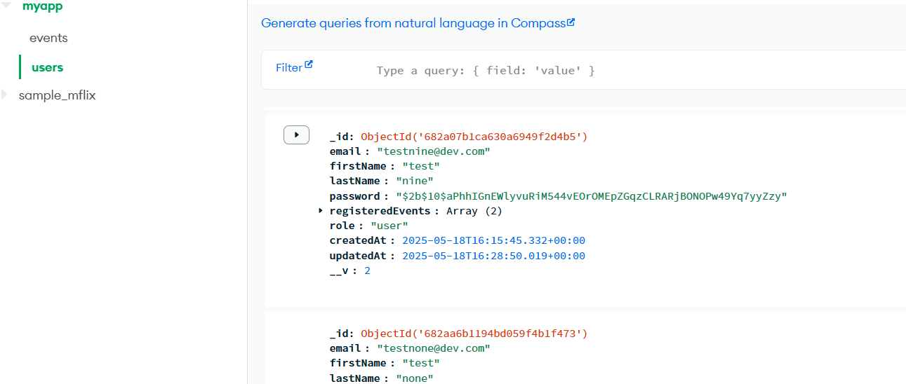

<div align="center">

# 🎥 UniStream — Campus Goes Live 🎥

## Live campus events made simple with real-time streaming using MERN

[](https://uni-stream.vercel.app)


</div>

---

<details>
<summary>📜 Table of Contents</summary>

- [About](#-about)
- [Live Demo](#-live-demo)
- [Demo Walkthroughs](#-demo-walkthroughs)
- [Features](#-features)
- [Tech Stack](#-tech-stack)
- [Project Structure](#-project-structure)
- [Getting Started](#-getting-started)
- [Database Schemas](#-database-schemas)

</details>

---

## About

UniStream is a **full-stack live event platform** that simplifies campus broadcasting. **Admins** can launch HD streams in minutes, while **students** join instantly with one click - no plugins or downloads needed.

Everything stays in sync with smart status updates, from **secure signups** to real-time streaming, all wrapped in an academic-friendly design.

---

## Live Demo

[](https://uni-stream.vercel.app)

> **Note:** The backend service is hosted on Render.com and may take up to 1 minute to wake up on first access.

> This project uses a REST API backend hosted on Render. Frontend users will experience this automatically.

### Demo Accounts

To experience all features of UniStream, you can use these test accounts:

| Role  | Email                 | Password     |
| ----- | --------------------- | ------------ |
| Admin | admin@unistream.edu   | DemoAdmin123 |
| User  | student@unistream.edu | DemoUser123  |

Or sign up with your own email to test the user experience!

<details>
<summary>⚠️ Security Disclaimer</summary>
  
This demo uses mock data with restricted permissions. For open-source self-hosting, please clone the repository and configure your own credentials.
</details>

---

## Demo Walkthroughs

### **Video 1 - Signup & Login:**

https://github.com/user-attachments/assets/7b38402a-33f7-412a-8b79-1f504634a58e

- Try to register for event → blocked until login
- Sign up → auto-redirects to login
- Wrong password? Shows error
- After login: see events, register, UI updates

### **Video 2 - Event Discovery:**

https://github.com/user-attachments/assets/c5f5ce66-4f0f-4844-b0ea-e508171e5837

- Smart search with debouncing
- Homepage vs Dashboard views
- Context-aware buttons
- Detailed event analytics

### **Video 3 - Full Experience:**

https://github.com/user-attachments/assets/fcc29dac-6099-4a86-821b-aee6d94b7eb1

🚀 **All features working in harmony - the complete UniStream experience!**

---

## Features

- Real-time live streaming via ZegoCloud
- Role-based UI for **admins** and **users**
- Smart event scheduling and status labels (Not Started, Started, Ended)
- User authentication & authorization
- Event registration & dynamic event list
- RESTful API with token-protected routes
- Fully responsive, clean UI

---

## Tech Stack

| Layer            | Tech                      |
| ---------------- | ------------------------- |
| Frontend         | React, Vite, Tailwind CSS |
| Backend          | Node.js, Express          |
| Database         | MongoDB + Mongoose        |
| Auth             | JWT, bcrypt               |
| Video Streaming  | ZegoUIKit (ZegoCloud SDK) |
| State Management | React Context API         |
| Notifications    | react-hot-toast           |

---

## Project Structure

```bash
/client
├── node_modules/
├── public/screens
│   └── vite.svg
├── src/
│   ├── assets/
│   ├── components/
│   │   ├── ui/
│   │   │   ├── Button.jsx
│   │   │   └── Input.jsx
│   │   ├── RegisteredEventListenerList.jsx
│   │   ├── Event.jsx
│   │   ├── Navbar.jsx
│   │   └── SearchBar.jsx
│   ├── contexts/
│   │   └── AppContext.jsx
│   ├── layouts/
│   │   └── Layout.jsx
│   ├── pages/
│   │   ├── Dashboard.jsx
│   │   ├── Error.jsx
│   │   ├── Event.jsx
│   │   ├── Home.jsx
│   │   ├── Login.jsx
│   │   ├── Room.jsx
│   │   └── Signup.jsx
│   ├── routes/
│   │   ├── NavigationRoutes.jsx
│   │   ├── ProtectedRoute.jsx
│   │   └── App.jsx
│   ├── index.css
│   └── main.jsx
├── .env
├── index.html
└── vercel.json

/server
├── controllers/
│   ├── authController.js
│   ├── eventController.js
│   └── lib/
│       ├── connection.js
│       └── roles.js
├── middlewares/
│   └── verifyToken.js
├── models/
│   ├── Event.js
│   └── User.js
├── routes/
│   ├── authRoutes.js
│   └── eventRoutes.js
├── .env
├── index.js
```

---

## Database Schemas

<div style="display: grid; grid-template-columns: repeat(2, 1fr); gap: 20px; margin: 30px 0;">

  <div style="border-radius: 8px; overflow: hidden; box-shadow: 0 4px 8px rgba(0,0,0,0.1);">
    
    <p style="text-align: center; margin-top: 8px; font-size: 0.9em;">User schema with auth fields and event references</p>
  </div>

  <div style="border-radius: 8px; overflow: hidden; box-shadow: 0 4px 8px rgba(0,0,0,0.1);">
    
    <p style="text-align: center; margin-top: 8px; font-size: 0.9em;">Event schema with timestamps and participant tracking</p>
  </div>

</div>
